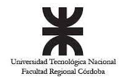

# PPAI - Diseño de sistemas UTN FRC

Esta aplicación es una aplicación de Spring Boot para la materia de Diseño de sistemas de información

 

#### Integrantes del grupo:

* Dapuez, Eliseo
* Díaz González, Juan.
* Galimberti, Emilio.
* Garzón, Sergio.
* Leal Stuyck, Emmanuel.
* Martinez, Joel.
* Melian, Agustin.
* Ortiz, Lucas.

 

